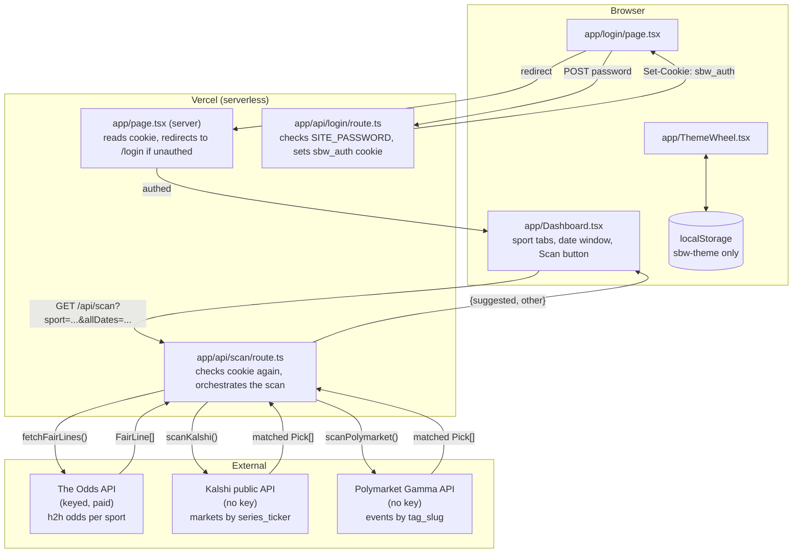

# ARCHITECTURE.md — sports-betting-web

All content **Verified** by direct source inspection at commit `26b6d83` unless marked otherwise; reconfirmed unchanged 2026-08-07 (checkpoint C-004 — app code has not changed since `26b6d83`, only documentation).

## System overview

A password-gated Next.js app with two real backend routes. The core feature (`/api/scan`) orchestrates three independent external data sources (one paid/keyed, two free/public), computes a de-vigged "fair probability" from the paid one, fuzzy-matches team names against the two free ones, and returns a scored, sorted list of positive-EV betting opportunities. There is no database — the two external sources ARE the data, fetched fresh on every scan.



## Frontend structure

- `app/layout.tsx`: root shell + no-flash theme-init inline script (same pattern as sibling repo, key `sbw-theme`, valid values `dark/light/vegas/field`).
- `app/page.tsx`: **server component**. Reads the `sbw_auth` cookie via `next/headers`'s `cookies()`, calls `isValidCookieToken()` from `lib/auth.ts`; if invalid, `redirect("/login")`; otherwise renders `<Dashboard />`.
- `app/Dashboard.tsx`: **client component**, the entire scanner UI. Owns `sport`, `allDates`, `loading`, `error`, `result` state. No persistence of scan results across reloads.
- `app/login/page.tsx`: client component, a password `<form>` that POSTs to `/api/login` and on success calls `router.push("/")` + `router.refresh()`.
- `app/ThemeWheel.tsx`: identical pattern to the sibling repo, different theme keys (`dark/light/vegas/field`) and labels (Stadium/Paper/Vegas/Field).
- `app/changelog/page.tsx`: static, public, unauthenticated.

## Backend structure

Two route handlers:
- `app/api/login/route.ts` — `POST` only. If `SITE_PASSWORD` isn't set, immediately returns `{ok:true}` (open access — see Known issues). Otherwise checks the submitted password via `lib/auth.ts`'s `checkPassword()`; on mismatch, sleeps 1 second (basic brute-force friction) then returns 403; on match, sets the `sbw_auth` cookie (httpOnly, `SameSite=Lax`, `Secure`, 1-year `maxAge`) to `tokenForPassword(password)` (a SHA-256 hash, not the raw password).
- `app/api/scan/route.ts` — `GET` only. Checks the cookie itself (independently of `app/page.tsx`'s check — see Coding conventions in `CLAUDE.md` for why this duplication is intentional). Validates the `sport` query param against `lib/sports.ts`'s `SPORTS` list. Checks `ODDS_API_KEY` is set (501 with a clear message if not). Calls `fetchFairLines()`, then `scanKalshi()`/`scanPolymarket()` **in parallel**, merges + sorts + splits the results, returns JSON.

## Server/client boundaries

- **Server-only:** `lib/auth.ts` (uses Node's `crypto` module — cannot run in the browser), `lib/oddsapi.ts`, `lib/kalshi.ts`, `lib/polymarket.ts` (all called only from `app/api/scan/route.ts`), `app/page.tsx`.
- **Client-only:** `app/Dashboard.tsx`, `app/login/page.tsx`, `app/ThemeWheel.tsx`.
- **Isomorphic:** `lib/ev.ts`, `lib/pick.ts`, `lib/match.ts`, `lib/sports.ts`, `lib/types.ts` — pure functions/data with no Node- or browser-specific APIs, though in practice all are currently only imported server-side (from `lib/kalshi.ts`/`lib/polymarket.ts`/`app/api/scan/route.ts`), never directly by a client component.

## Request lifecycle (a scan)

1. User clicks "Scan" in `Dashboard.tsx` → `fetch('/api/scan?sport=mlb&allDates=false', { cache: 'no-store' })`.
2. Route handler checks the `sbw_auth` cookie against `isValidCookieToken()`. 401 if invalid.
3. Validates `sport` against `sportByKey()`. 400 if unknown.
4. Checks `ODDS_API_KEY` env var exists. 501 if not.
5. `fetchFairLines(sport.oddsKey, apiKey)` — one Odds API call per sport, `markets=h2h,regions=us,oddsFormat=decimal`. For each event, for each bookmaker's `h2h` market, computes implied probability (`1/decimal_price`), normalizes within that book (sum to 1), then averages across all books that had the market → the "fair probability" per team. Returns `FairLine[]` (one per game: `{eventId, sportKey, commenceTime, homeTeam, awayTeam, fairProbs}`).
6. Filters `FairLine[]` by date window (`isTodayOrTomorrowOrAll` — UTC calendar-day comparison, or pass-through if `allDates=true`).
7. **In parallel:** `scanKalshi(sport.label, sport.kalshiSeries, filteredLines)` and `scanPolymarket(sport.label, sport.polyTag, filteredLines)`.
   - Kalshi: fetches ALL markets for the series ticker (paginated via `cursor`, no `status` query param — see `DECISIONS.md` for why), filters client-side to `status === "active"`, for each market with a valid price, finds candidate `FairLine`s within a 30-hour window of the market's `expected_expiration_time` (falling back to `close_time`), fuzzy-matches the market's `yes_sub_title`/`title` against the candidate's `homeTeam`/`awayTeam` via `lib/match.ts`, sanity-checks the *other* team is also referenced in the title, then builds a `Pick` via `lib/pick.ts`.
   - Polymarket: fetches events for the tag_slug (ordered by `volume24hr`), for each market checks `question === event.title` (this is what distinguishes a true moneyline market from a spread/total market on the same event — both use team names as outcomes, only the moneyline market's question matches the event's own title), parses the double-JSON-encoded `outcomes`/`outcomePrices` strings, finds a *unique* matching `FairLine` (ambiguous matches — more than one candidate — are dropped, not guessed), builds two `Pick`s (one per side) via `lib/pick.ts`.
8. Route handler merges both `Pick[]` arrays, sorts by `edgePct` descending, splits into `suggested` (favorite in the -200 to -1000 band) vs `other`.
9. Returns `{ sport, eventsScanned, eventsInWindow, suggested, other, ts }`.
10. `Dashboard.tsx` renders hero cards for `suggested`, a table for `other`.

## Data flow

One-directional, read-only: 3 external APIs → route handler → client. No write path to any of the 3 external services (no bets are ever placed).

## Authentication flow

See `CLAUDE.md`/`SECURITY.md` for full detail. Summary: shared password → SHA-256 token → httpOnly cookie → checked independently by `app/page.tsx` (page access) and `app/api/scan/route.ts` (API access). No `middleware.ts` — this is a structural gap for any *future* route (see Known issues).

## Authorization flow

Binary (authed/not). No roles, no per-resource permissions — there's nothing to own, every scan result is ephemeral and not tied to a "user."

## Database access flow

Not applicable.

## Storage flow

`localStorage` for theme choice only (`sbw-theme`). The httpOnly auth cookie is invisible to client JS (`document.cookie` cannot read it) — this is intentional.

## External API flow

See Request lifecycle. Three integrations, all server-side only, all called fresh on every scan (no caching):
- **The Odds API** — keyed, costs credits per call (regions × markets, per their pricing model — not independently re-verified this session beyond "it costs credits," which is why the app is password-gated at all).
- **Kalshi** — public, no key, `https://api.elections.kalshi.com/trade-api/v2`.
- **Polymarket** — public, no key, `https://gamma-api.polymarket.com`.

## Real-time communication / multiplayer

Not applicable.

## Background / scheduled jobs

None. Every scan is triggered by a live button click.

## Caching

None in the data path — every scan re-fetches all 3 sources fresh (deliberate, since stale betting-market prices would be actively misleading).

## State management

Plain React `useState` in `Dashboard.tsx`, `ThemeWheel.tsx`. No Context/Redux.

## Error handling

`OddsApiError` (custom class in `lib/oddsapi.ts`) carries an HTTP status from the upstream Odds API call, mapped in the route handler to either the same status or 502 (502 specifically if the upstream status was 401, to avoid confusing "you're not authed to *this app*" with "the Odds API key is bad" — both would otherwise show as 401 to the same client-side error-handling code). All other errors → generic 502 with the error's message.

## Logging

None custom — default Vercel function logs only.

## Deployment architecture

Vercel, same pattern as sibling repo. Two required env vars (see `CLAUDE.md`).

## Scaling considerations

The Odds API cost is the real constraint, not traffic volume — this is why the whole app is password-gated (to prevent random visitors from burning paid credits), not because of a technical scaling limit.

## Security boundaries

The password gate is the only boundary. See `SECURITY.md` for the full review, including the no-`middleware.ts` gap and the reused-Odds-API-key note.

## Major architectural risks

1. **No `middleware.ts` — auth enforcement is per-route, not centralized.** Any new route added later must remember to check the cookie itself, or it will be silently public.
2. **Team-name matching is fuzzy/best-effort**, not a maintained alias table — accuracy depends on token-overlap heuristics in `lib/match.ts` and is a known, accepted v1 limitation (not a bug).
3. **Three external API integrations, two of which are third-party public APIs with undocumented quirks already discovered the hard way this session** (Kalshi's `status` filter meaning, `close_time` vs `expected_expiration_time`, Polymarket's spread-markets-also-use-team-names behavior). Any of these providers changing their API behavior again could silently break matching or scoring with no compile-time signal.
4. **No tests** covering the de-vig math, the matching heuristics, or the Kelly-stake calculation — all currently verified only by spot-checking live results against manual reasoning.

## Background notification path (added 2026-08-11)

A second, independent request path exists alongside the manual scan flow above:

```
Vercel Cron (*/15 * * * *, vercel.json)
  --> GET /api/cron/scan (Authorization: Bearer CRON_SECRET)
      --> lib/runScan.ts, once per sport in lib/sports.ts (same pipeline app/api/scan/route.ts uses)
          --> for each "suggested" pick: lib/pushSubscriptions.ts's markNotifiedIfNew()
              (Upstash Redis SET ... NX, 26h TTL -- atomic check-and-mark)
              --> if new: lib/notify.ts's sendPickNotification()
                  --> web-push (VAPID) --> every stored PushSubscription
                      --> browser's public/sw.js --> OS notification
```

A device enrolls via `app/NotificationsToggle.tsx` (Dashboard header): requests Notification permission, subscribes the service worker with the server's VAPID public key (`GET /api/push/vapid-key`), and POSTs the resulting `PushSubscription` to `POST /api/push/subscribe`, which `lib/pushSubscriptions.ts` stores in a Redis hash. Unlike every other route in this app, `/api/cron/scan` is NOT cookie-gated (a cron trigger can't log in) — it's gated by `CRON_SECRET` instead, checked inline (see `SECURITY.md`).

This path reuses `lib/runScan.ts` (the scan pipeline, factored out of `app/api/scan/route.ts` this same session) rather than duplicating it — the manual-scan flow diagrammed above is otherwise completely unchanged.
